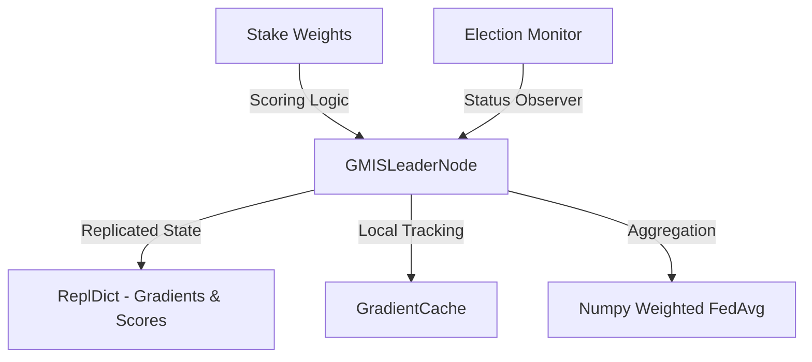

# Auralis: System Architecture

Auralis is designed as a decentralized, fault-tolerant federated learning system with a leader-based aggregation layer.

## Raft Leader-Based Aggregation Layer

The `raft_leader` module implements a robust leader election mechanism using the Raft consensus protocol via `pysyncobj`. This ensures that even if the current leader fails, the cluster can elect a new leader and continue aggregating gradients.

### Core Components

- **GMISLeaderNode**: Extends `pysyncobj.SyncObj`, providing a replicated state machine for gradient distribution and stakeholder scoring.
- **ReplDict**: Used to synchronize round gradients and contribution scores across all cluster members.
- **GradientCache**: A thread-safe local cache for gradients received by each node. This allows a newly elected leader to "recover" the current round by re-submitting locally-received gradients to the new replicated state.
- **Stakeholder Weights**: Each participant is assigned a contribution score based on three metrics:
  - **Gradient Quality (40%)**: Metric from the local model evaluation.
  - **Drift Score (35%)**: Penalty for data distribution shift.
  - **Uptime (25%)**: Bonus for node availability.

### Mid-Round Recovery Workflow

1. Nodes submit gradients to the current leader.
2. The leader replicates the gradient to followers via the `submit_gradient` replicated method.
3. If the leader crashes mid-round:
   - A new leader is elected.
   - The new leader calls `recover_round(round_id)`.
   - Any gradients cached in the new leader's `GradientCache` are re-broadcast to ensure the consensus state is up to date.
4. Aggregation occurs when a majority of participants have submitted their data.

### Weighted FedAvg

The system performs aggregation using a weighted version of the Federated Averaging (FedAvg) algorithm. Each participant's gradient contribution is weighted by their normalized contribution score (stake).
